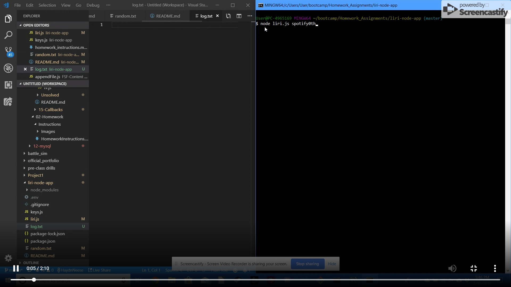

# **LIRI-NODE-APP**

**-----IMPORTANT-----**

*In order to use this app you must you must first make your own .env file* 

---
## **HOW IT WORKS**
---
The Liri-Node-App is a CLI app that receives user input and provides it to three separate API's to retrieve information about: 

*       Song information through the use of the Spotify API
    * Required syntax:
        * **spotify-this-song** < *song name* >
    * If the user fails to type **spotify-this-song** correctly or at all the program will remind the user of how to use the correct syntax
    * If the user types **spotify-this-song** and does not put a song name the program will automatically enter a song name for them
    *   The program will write the API information to a local file called log.txt

*       Concert information through the use of the Bands In Town API
    * required syntax:
        *  **concert-this** < *band name* >
    * If the user fails to type **concert-this** correctly or at all the program will remind the user of how to use the correct syntax
    * If the user types **concert-this** and does not put a song name then the program will automatically enter a band name for them
    *   The program will write the API information to a local file called log.txt

*        Movie information through the use of the OMDB API
    * required syntax:
        * **movie-this** < *movie name* >
    * If the user fails to type **movie-this** correctly or at all the program will remind the user of how to use the correct syntax 
    * If the user types **movie-this** and does not put a song name then the program will automatically enter a movie name for them
    *   The program will write the API information to a local file called log.txt

*       If the user inputs **do-what-it-says** it will read a local .txt file to run the spotify-this-song command for "I Want It That Way"
    *   The program will write the API information to a local file called log.txt

---
## **HOW IT IS USEFUL**
---

        The CLI application allows the user to quickly find information on songs, bands, and movies by quickly typing into the terminal and receiving neatly organized search results.
---
## **VIDEO EXAMPLE**

---
## **PICTURE EXAMPLES**
---
### ERROR MESSAGE EXAMPLE

---
### SPOTIFY NO SONG

---
### SPOTIFY W/ SONG

---
### CONCERT NO BAND

---
### CONCERT W/ BAND

---
### MOVIE NO TITLE

---
### MOVIE W/ TITLE

---
### DO WHAT IT SAYS

